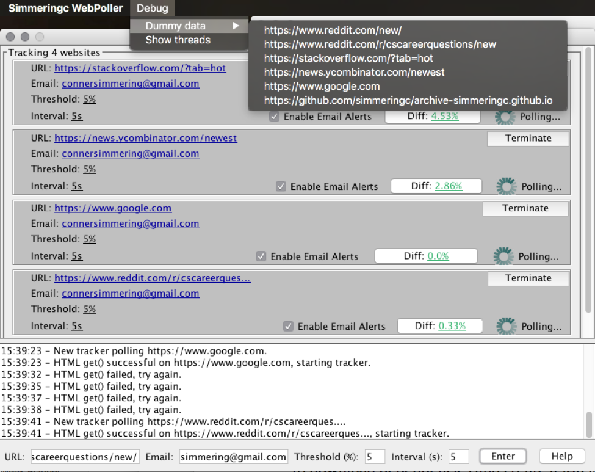

# Simmeringc WebPoller

The **Simmeringc WebPoller** is a Java application that lets a user track webpage changes live.

The application enables users to see the percentage change of a website since the time of tracking, and view a diff of the updated content.

An email is sent to the specified address if the website has changed enough to trigger the change-threshold set by the user.

## Installation

The application is build with Maven. Clone and execute:

```
mvn clean install
```

to download dependencies and create a JAR in the '/target/' folder.

Maven should specify dependencies, classpaths and Java 1.8 to your IDE.

The application can be built and run in your IDE or from the generated JAR:

'website-poller-development-jar-with-dependencies.jar'

## Testing:

Access the Menu Toolbar and enter your email to quickly test the applications features.



## HTML Filter Policy:

Visit ‘/controllers/HtmlSanitizer.jar’ to view the policies for which a diff is calculated. The application can be extended to monitor specific HTML tags or even tag Id’s.
