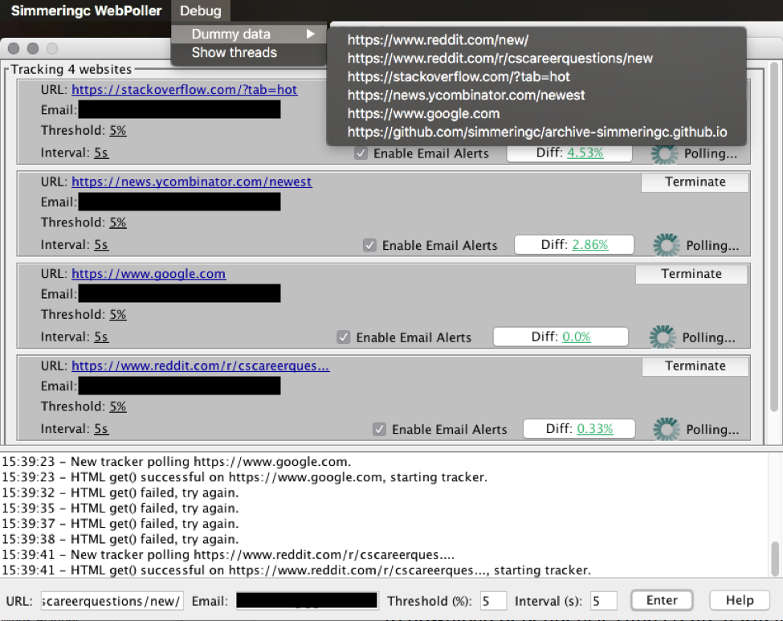

# Java WebPoller

**java-webPoller** is a Java application that lets users track live webpage changes.

The application lets users monitor the percentage change of a website since the time of tracking, and view a diff of the updated content.

An email is sent to the specified address if the website has changed enough to trigger the change-threshold set by the user.

## Build and Run:

The application is built with Maven. Clone and execute:

```
mvn clean install
```

The application can be built and run from the MainWindow class or from the generated JAR:

'target/website-poller-development-jar-with-dependencies.jar'

## Live Testing:

Access the Menu Toolbar and enter your email to quickly test the applications features. Note that most Reddit links do not currently work.

 

## HTML Filter Policy:

Visit ‘/controllers/HtmlSanitizer.jar’ to view the policies for which a diff is calculated. The application can be extended to monitor specific HTML tags or even tag Id’s.

## String Similarity:

The WebPoller computes the difference in HTML page similarity by finding out how many adjacent character pairs are contained in both HTML body strings. This is done by implementing a variation of the Dice's Coefficient algorithm:


## Other notes:

This application purposely pollutes the static namespace in order to demonstrate statics and Java multithreading. 

